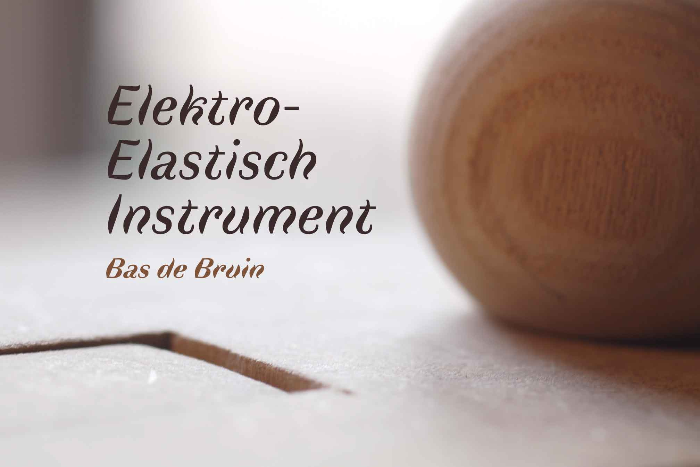
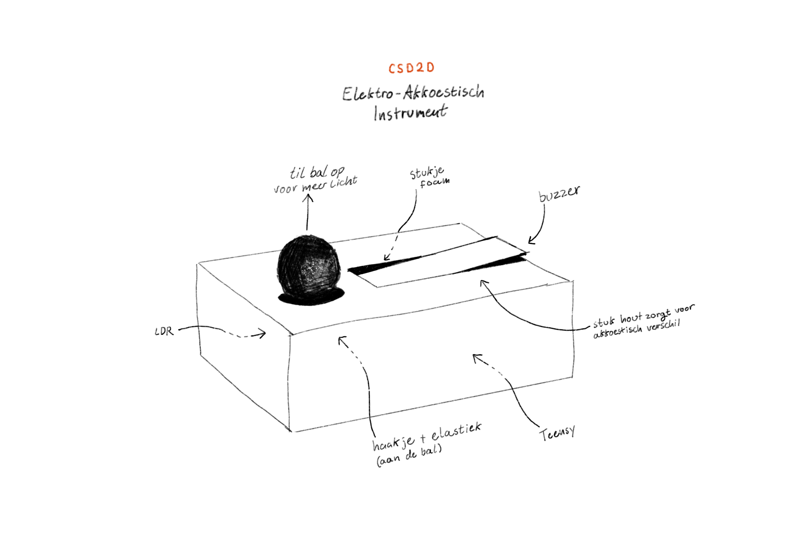
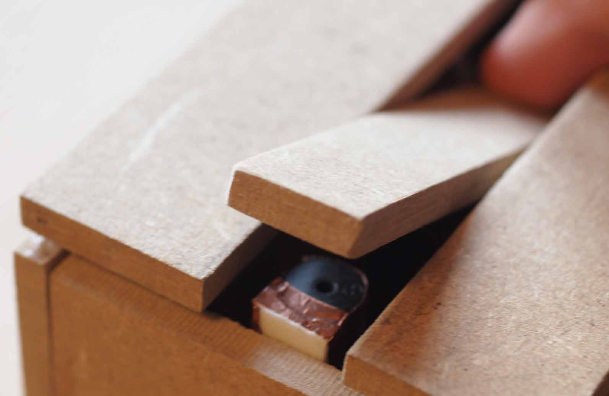
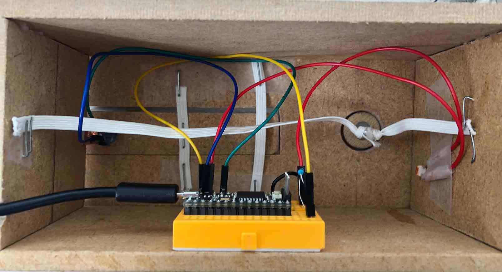

> Voor de Elektro-Akkoestische opdracht voor CSD2D

## Concept

Het doel van dit concept is uitzoeken hoe ik zo veel mogelijk interactie en verschillen ik kon halen uit 2 onderdelen: 
* een piezo buzzer (zo'n iritant speakertje dat in rookalarmen zit)
* een ldr (als bespeelbare input)

(plus een mdf plankje, wat elastiek en natuurlijk een teensy)

Ik merkte dat door een blokje hout op verschillende afstanden te houden van de buzzer, ik een soort filter effect kon krijgen. 

## Uitvoering

Om een interessante manier van interactie te creëeren besloot ik een houten bal aan elastiek te koppelen, door deze op te tillen valt er meer licht in het doosje en registreerd de LDR een hogere waarde.

Ik heb een soort hefboom gemaakt van een plankje hout en 2 stukken elastiek. Wanneer je deze indrukt, komt de andere kant van het plankje los van de buzzer waardoor de klank van de buzzer verranderd.

Het geluid dat het hout maakt als je de bal laat vallen of als je de 'hefboom' indrukt voegt een percussief element aan het instrument toe.

Voor de uitvoering heb ik een klein breadboardje gebruikt met losse draadje die naar de buzzer en LDR lopen.
De code die op de teensy draait is redelijk simpel, zie: `elektrisch_elastisch.ino`. Maar deze opdracht is een soort van test van eenvoud geworden, waarbij ik met zo min mogelijk snufjes, toch interessante speelmethodes en geluiden kon maken.

Ik denk wel dat dat is gelukt, het is in ieder geval 'interessant'.